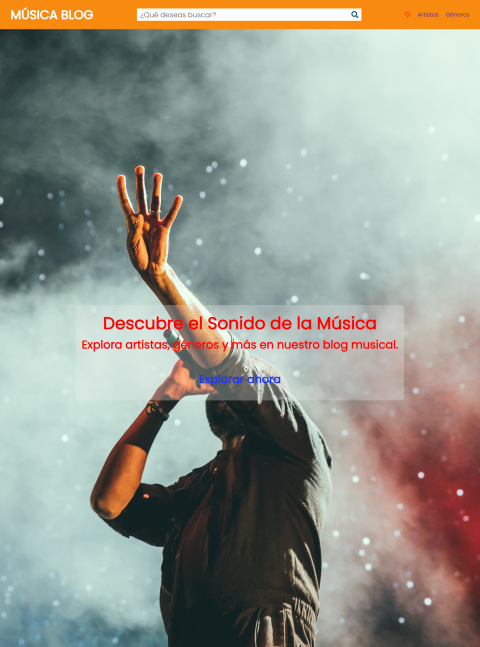

# Blog de Música

Bienvenido al Blog de Música, un sitio web dedicado a explorar artistas, géneros y noticias musicales. Este repositorio contiene el código HTML y CSS para construir el sitio web.

## Características

- Encabezado con navegación interactiva y búsqueda de contenido.
- Sección de héroe con título y llamada a la acción.
- Sección de artistas destacados con imágenes y descripciones.
- Sección de artículos recientes con imágenes y enlaces a los artículos.
- Pie de página con enlaces a la política de privacidad, términos y condiciones, y contacto.

## Vista Previa

## Tecnologías Utilizadas

- HTML5
- CSS3
- [Font Awesome](https://fontawesome.com/) para iconos

## Cómo Usar

1. Clona este repositorio en tu máquina local.
2. Abre el archivo `index.html` en tu navegador para ver el sitio web.

## Estructura de Carpetas

- `styles/` contiene el archivo CSS con estilos personalizados.
- `img/` contiene las imágenes utilizadas en el sitio.
- `pages/` contiene el archivo `index.html` .

## Personalización

Si deseas personalizar este sitio web, puedes hacerlo ajustando los siguientes elementos:

- Cambia las imágenes en la carpeta `img/` por las que quieras utilizar.
- Modifica los textos, títulos y descripciones en el archivo `index.html` para reflejar el contenido de tu blog.
- Personaliza los estilos en el archivo CSS `estilos.css` para adaptar la apariencia a tus preferencias.

## Contribuciones

Las contribuciones son bienvenidas. Si encuentras problemas, mejoras o nuevas características que podrían ser agregadas, siéntete libre de abrir un "issue" o enviar una solicitud de extracción.

